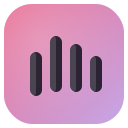

<div align="center">

#  CampBand

**A modern alternative client for Bandcamp** — Experience indie music discovery the way it should be.

[](https://rosepinetheme.com)
[](https://www.mozilla.org/firefox/)
[](https://cursor.com)

CampBand transforms Bandcamp into a sleek, Spotify-like music streaming experience. Browse artist discographies, explore albums, build playback queues, and save your favorites — all wrapped in a beautiful theme with liquid glass effects.

**Smooth and seamless music browsing.**

</div>

---

## 🎬 Showcase

<div align="center">

<video src="./docs/showcase/showcase.mp4" controls width="800" style="max-width: 100%; border-radius: 12px; box-shadow: 0 8px 32px rgba(0, 0, 0, 0.3);">

Your browser does not support the video tag. [Download the showcase video](./docs/showcase/showcase.mp4) instead.

</video>

<sub>Watch CampBand in action — smooth browsing, beautiful UI, and seamless playback</sub>

</div>

---

## ✨ Features

<div align="center">

| 🎨 **Interface** | 🎵 **Playback** | 🔧 **Tools** |
|:---:|:---:|:---:|
| Beautiful Rosé Pine theme | High-quality audio streaming | Search & discovery |
| Liquid glass effects | Crossfade & gapless playback | Queue management |
| Blurred album backdrops | Volume normalization | Favorites system |
| Responsive design | Media key support | Last.fm scrobbling |

</div>

### Detailed Features

- 🔍 **Search** — Find artists, albums, and tracks instantly
- 🎨 **Artist Pages** — Browse full discographies with beautiful cover art
- 💿 **Album View** — Track listings with lyrics and metadata
- 🎵 **Audio Player** — Play, pause, skip, shuffle, repeat with smooth transitions
- 📋 **Queue System** — Slide-out queue panel with drag & drop reordering
- ❤️ **Favorites** — Save your favorite artists, albums, and tracks
- 🌙 **Rosé Pine Theme** — Beautiful dark UI with liquid glass effects
- ✨ **Blurred Backdrops** — Album art becomes gorgeous, glowing backgrounds
- 🖥️ **Media Controls** — Works with Windows/OS media keys
- 📊 **Equalizer** — Customizable EQ with presets
- 🔄 **Last.fm Integration** — Automatic track scrobbling

---

## 🚀 Quick Start

### Prerequisites

- [Node.js](https://nodejs.org/) (v18 or higher)
- [pnpm](https://pnpm.io/) package manager
- [Firefox](https://www.mozilla.org/firefox/) browser

### Install from Source

```bash
# Clone the repository
git clone https://github.com/purr/campband.git
cd campband

# Install dependencies
pnpm install

# Start development server
pnpm dev
```

### Build for Firefox

```bash
# Build the extension
pnpm build

# Create distributable package
pnpm zip
```

Then load the `.xpi` file as a temporary add-on in Firefox:
1. Open Firefox and navigate to `about:debugging`
2. Click "This Firefox"
3. Click "Load Temporary Add-on"
4. Select the `.xpi` file from the `dist` folder

---

## 📖 How to Use

<div align="center">

1. **Click the CampBand icon** in Firefox toolbar
2. **Search** for artists or browse music
3. **Click Play** to start listening
4. **Use ❤️** to save favorites
5. **Use ➕** to add tracks to your queue

</div>

---

## 📚 Documentation

<div align="center">

| Document | Description |
|:---|:---|
| [📘 Technical Docs](./docs/TECHNICAL.md) | Architecture, APIs, and development guide |
| [🎨 Design System](./docs/DESIGN_SYSTEM.md) | Visual design guide and components |
| [🗺️ Roadmap](./docs/ROADMAP.md) | Feature roadmap and future plans |
| [✅ TODO](./docs/TODO.md) | Task tracking and progress |

</div>

---

## 🙏 Credits

<div align="center">

**Built with [Cursor](https://cursor.com)** — AI-powered code editor that made this project possible.
Huge thanks to Claude for being an incredible pair programming partner! 🤖✨

### Inspiration & Resources

| Resource | Description |
|:---|:---|
| [Rosé Pine](https://rosepinetheme.com) | The beautiful dark theme |
| [free-bandcamp-downloader](https://github.com/7x11x13/free-bandcamp-downloader) | Bandcamp data extraction by 7x11x13 |
| [hidden-bandcamp-tracks](https://github.com/7x11x13/hidden-bandcamp-tracks) | Hidden track detection by 7x11x13 |

</div>

---

## ⚖️ Legal

<div align="center">

<sub>This is an unofficial client. Please support artists by purchasing music on [Bandcamp](https://bandcamp.com).</sub>

</div>

---

<div align="center">

## 📄 License

**MIT**

Made with ❤️ for the indie music community

</div>
